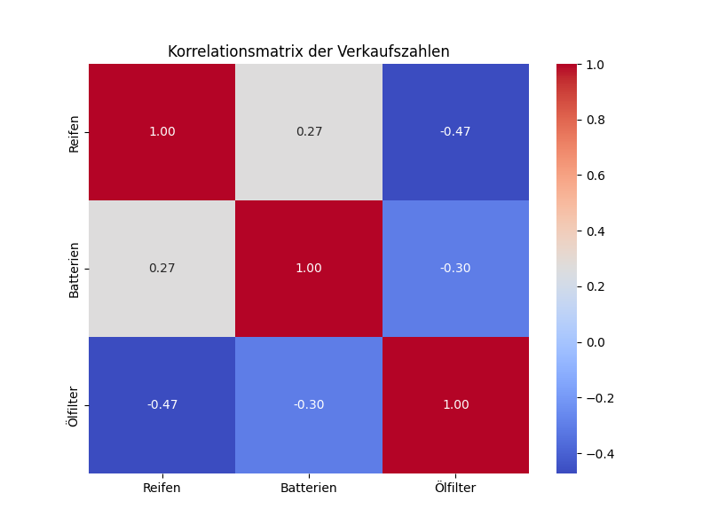
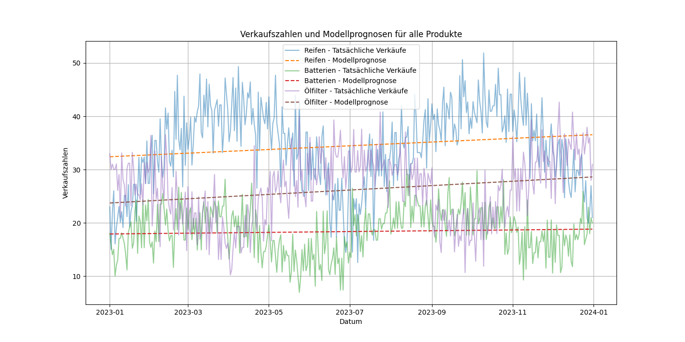

# Data Mining showcase

## Einleitung
Dieses Projekt zeigt einen simplen Showcase eines Handelsunternehmens auf, welches sich auf Autoteile spezialisiert hat. Die Müller Autohandel GmbH ist ein fiktives mittelständisches Unternehmen. 

Die Firma erhält durch den Einsatz von Datamining wichtige Insights für die Entscheidungsgrundlage des laufenden Geschäftsjahres. 

Dadurch kann eine Verkaufsprognose und Korrelationen erstellt werden. Diese sind wiederrum extrem hilfreich um den Einkauf, den Lagerbestand und das Marketing möglichst effizient zu gestalten.

**Wichtig:** Das Beispiel ist stark vereinfach und lässt sich beliebig komplexer gestalten unter Einbezug weiterer Datenquellen und Auswertung weiterer Kennzahlen.


## Vorraussetzungen 

- Python 3+

## Vorbereitung

1. Python module installieren via:
    ```
     pip install -r requirements.txt
    ````
    oder alerternativ virutelles environment in vscode nutzen (.venv)
2. (Optional) Beispieldaten erzeugen via:
   ````
    python3 fake_data_generator.py
   ````

## Getting started

Script ausführen via:
````
python3 app.py
````

## Beispiel Ergebnisse



